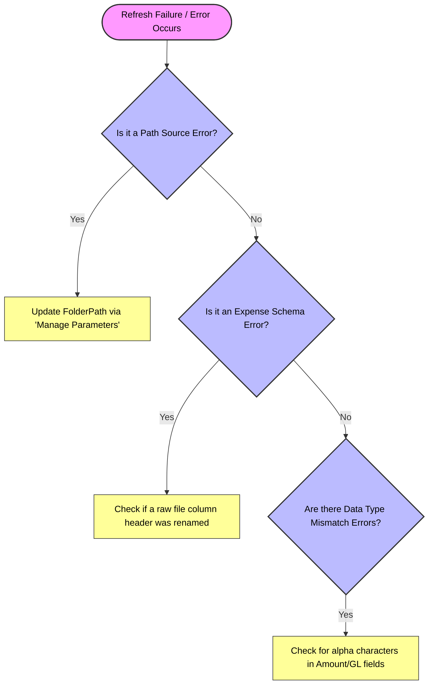

# Financial Reporting Process Transformation (Lean Six Sigma Green Belt)
## 🚀 Executive Summary & ROI
An enterprise-grade optimization project integrating **Lean Six Sigma methodologies** with **FP&A workflows** to automate the Travel & Expense (T&E) reporting pipeline. By architecting an automated ETL pipeline using **Power Query** and **Power BI**, this project completely eliminated manual data manipulation.
* **Weekly Reporting Cycle Time:** Reduced from **48 Hours** to **Fully Automated (<5 mins refresh)**
* **Monthly Reporting Cycle Time:** Reduced from **36 Hours** to **Fully Automated (<5 mins refresh)**
* **Defect Rate:** Dropped to **0%** by eliminating manual copy-paste errors, broken `VLOOKUP`/`XLOOKUP` formulas, and split-week structural anomalies.
---
## 📈 Core Skills Demonstrated
* **Process Improvement:** Lean Six Sigma DMAIC Framework, Root Cause Analysis, SIPOC Mapping, Control Plans.
* **Corporate Finance / FP&A:** Month-End Close Adjustments, Accrual Dynamics, SG&A, OPEX & T&E Control Frameworks, Variance Analysis.
* **Data Engineering:** Power Query (M-Code), Star Schema Relational Data Modeling, Dynamic Parameterization.
* **Business Intelligence:** Power BI Dashboard Design, Advanced DAX Measures.
---
## 🛠️ The Problem vs. The Solution
### The "As-Is" Manual Process (Muda/Waste)
Previously, the process required manually extracting and consolidating data from 6 fragmented enterprise datasets. It involved heavy reliance on volatile Excel functions (`SUMIFS`, `VLOOKUPs`) and manual layout adjustments. 
* **The Obsolete Data Challenge:** Weekly reporting during month-end overlaps became highly complex because historical weeks became obsolete once books of accounts were officially closed and adjusted monthly.
### The "To-Be" Automated Pipeline
Developed a dynamic Power Query architecture that ingests expanding year-to-date folders, normalizes conflicting split-week schemas, handles month-end accounting overrides, and pipes clean data directly into a centralized Power BI model (`Variance Analysis.pbix`).

---
## 📂 Repository Architecture
The project maintains a structured folder hierarchy that replicates a real-world enterprise financial data environment. The directory layout is preserved exactly as is to protect global file-path parameter links built into the Power Query engine.
```
📁 Automated-FPnA-Reporting-Transformation/
└── 📁 Variance Analysis/                # Core Analytics & Pipeline Directory
│	├── 📁 2025/                         # Historical Financial Year Data
│	│   ├── 📁 Monthly/                  # January to December Adjusted Month-End Actuals
│	│   └── 📁 Weekly/                   # Chronological Week 01 to Week 53 Actuals
│	├── 📁 2026/                         # Current Financial Year Data (YTD)
│	│   ├── 📁 Monthly/                  # Closed Books Actuals (Jan - June) + Open Month (July)
│	│   └── 📁 Weekly/                   # Active Weeks (Current Month Work-in-Progress Data)
│	├── 📄 Company Data.xlsx             # Central Workbook hosting Master Datasets & Reference Tables
│	│   ├── 📊 Sheet1 (Pivot Analysis)   # Legacy Pivot Reconciliations
│	│   ├── 📊 General Ledger            # Chart of Accounts (GL Numbers, Sub-Categories, GAAP Groupings)
│	│   ├── 📊 Department List           # Dept Codes mapped to L1/Director Level Managers & Emails
│	│   ├── 📊 Employee Data             # Unique Employee IDs, Reporting Structures, and Active Status
│	│   ├── 📊 Monthly Budget            # Static OPEX & SG&A Financial Year Budgets
│	│   ├── 📊 Weekly Budget 2025        # 53-Week Target Distribution Matrix (Prior Year)
│	│   └── 📊 Weekly Budget 2026        # 53-Week Target Distribution Matrix (Current Year)
│	├── 📊 Variance Analysis.pbix        # Unified Power BI Analytics Engine & Relational Star Schema Model
│
├── 📄 README.md                                    # Project Portfolio Landing Page
├── 📄 Project Charter.md                           # Business Case, Scope Boundaries & CTQs
├── 📄 DMAIC Report.md                              # Full Process Documentation (Define-Control)
├── 📄 SOP.md                                       # Standard Operating Procedure for Operators
│
├── 📕 Brief Overview of the reporting process.pdf  # Project SOP Documentation Export
├── 📕 DMAIC Root Cause Identification (Fishbone Diagram).pdf
└── 📕 Process Optimization Bottlenecks (Pareto Chart).pdf
```
### 🔍 Architectural Highlights:
* **M-Code Compatibility:** The folder naming convention directly mirrors the internal Power Query dynamic file-ingestion parameters, supporting multi-year automated evaluations.
* **Separation of Concerns:** Transformed transactions, target budgets, and master data catalogs are kept completely independent to minimize schema friction during pipeline compilation.
---
## 🛠️ How to Run This Model (Dynamic Path Configuration)
This model uses **Power Query Parameters** to manage file paths globally. If you download this repository to review the data pipelines, you do not need to change individual query steps. You can update the source path globally in under 60 seconds:
### Step-by-Step Path Setup:
1. Download the files or clone this repository to your local drive.
2. Open `Variance Analysis.pbix` in **Power BI Desktop**.
3. On the **Home** tab of the ribbon, click the dropdown arrow under **Transform Data** and select **Edit Parameters**.
   *(Alternatively, click **Transform Data** to open the Power Query Editor, and click **Manage Parameters** in the Home ribbon).*
4. Update the value of the path parameter (e.g., `File_Source_Directory`) to match the local folder path where you saved this repository on your computer.
5. Click **OK**, then click **Apply Changes** on the yellow warning bar. The entire ETL pipeline will automatically refresh against your local data copies without breaking any steps!
---
## 🛡️ Lean Six Sigma Control Plan & Governance Framework
**Project Name:** Automated SG&A Expenses (T&E) Reporting Process Transformation  
**Process Owner:** Corporate FP&A Team  
**System Environment:** Power Query (M) & Power BI Desktop  
**Control Plan Implementation Date:** July 2026  
### 1. Core Control Matrix
This matrix establishes the operational guards required to sustain the automated refresh cycle time (< 10 minutes) and eliminate transaction ingestion errors.

| Process Step             | Control Parameter                    | Target / Specification                                                                                          | Measurement Method                                           | Sample Size / Frequency | Responsible Party                | Corrective Action Trigger                                                             |
| :----------------------- | :----------------------------------- | :-------------------------------------------------------------------------------------------------------------- | :----------------------------------------------------------- | :---------------------- | :------------------------------- | :------------------------------------------------------------------------------------ |
| **Data Ingestion**       | Local Root Folder Directory Path     | Path must point accurately to the root `Variance Analysis` folder                                               | Power Query Global Parameter Check (`FolderPath`)            | Every scheduled refresh | Data Analyst / End User          | Yellow warning banner / Ingestion error: Execute Path Correction Setup. `(Readme.md)` |
| **File Dropping**        | Inbound Filename Inconsistency       | Files must sit in structural directories (`2026/Monthly/` or `2026/Weekly/`)                                    | Query Metadata Scanning Function                             | Continuous (On Drop)    | Accounting Clerks / Spend Admins | Missing file or schema error: Verify file landing match against SOP rules.            |
| **Schema Integrity**     | Column Count & Data Type Matching    | 4 Core Transaction Types: `Unique Id` (Text), `Amount spent` (Decimal), `Spend date` (Date), `GL Numbers` (Int) | Power Query Hard-Typed Schema Transformation                 | Every execution cycle   | FP&A Data Architect              | Column Missing Error: Roll back raw file to standard IT export layout.                |
| **Data Synchronization** | Variance against General Ledger (GL) | $0.00 absolute variance between Power BI Model Total Spend and Closed GL System Actuals                         | DAX Measure Reconciliation Check (`[GL_Reconciliation_Gap]`) | Monthly Close out       | FP&A Manager                     | Variance > $0.00: Check for unmapped Employee IDs or missing GL Account numbers.      |
### 2. Standard Operating Procedures (SOP) for Maintenance
To preserve pipeline automation long-term, the process operators must adhere to these two maintenance guidelines:
#### 2.1 Appending New Transactional Records (Monthly/Weekly)
1. **Extraction:** Download the raw Credit Card Transaction file from the corporate card expense portal.
2. **Formatting:** Do not change column headers, rearrange data columns, or remove empty fields manually. 
3. **Filing:** Move the raw workbook into the appropriate folder based on the fiscal cycle. 
   * *Example:* Current weekly data goes directly to: `.../Variance Analysis/2026/Weekly/`
4. **Refresh:** Open `Variance Analysis.pbix` and click **Refresh** on the Home ribbon.
#### 2.2 Updating Dimensional Registries (`Company Data.xlsx`)
When structural changes occur in corporate hierarchies, they must be updated in the central reference workbook before refreshing the dashboard:
* **New Employee Onboarding / Offboarding:** Add the new employee's row to the `Employee Data` sheet. If an employee resigns, flip their status to `Resigned`. The Power Query transformation engine will seamlessly capture this status change without generating look-up errors (`#N/A`).
* **Cost Center Changes:** Any newly created department numbers or sub-accounts must be appended immediately to the `Department List` or `General Ledger` reference tables.
### 3. Out-of-Control Action Plan (OCAP)
If the Power BI dashboard fails to refresh or displays data disparities, the process operator must execute the following troubleshooting logic:

1. **Path Failures:** Verify that the current user's local directory matches the global `FolderPath` parameter value inside Power Query. If the repository was moved or cloned to a new machine, re-link the root parameter using the **Manage Parameters** option.
2. **Data Mismatches:** If row cells contain text in numeric columns (e.g., typos in currency figures), navigate to the Power Query editor, trace the error row using the `Keep Errors` diagnostic step, and fix the malformed field in the source Excel sheet.