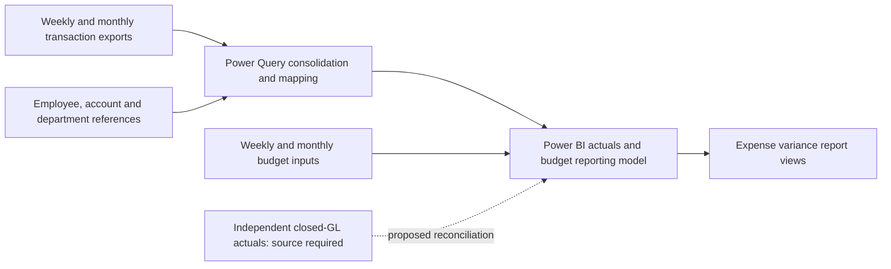

# T&E Expense Variance Reporting with Power BI

**FP&A reporting case study · Lean Six Sigma DMAIC / Green Belt project**  
**Project author:** Parth Joshi · **Documentation revision:** October 6, 2026

## Business Problem and Solution

Weekly and monthly Travel & Entertainment (T&E) reporting requires consistent expense classification, comparable budgets and clear treatment of month-end adjustments. This project documents a Power Query and Power BI workflow for consolidating credit-card inputs, maintaining employee/account/department mappings and supporting Selling, General and Administrative (SG&A) budget-versus-actual reporting.

The business purpose is to make reporting preparation maintainable and provide department managers and FP&A leadership with traceable expense comparisons. The portfolio presents the documented solution, DMAIC analysis and reporting-control design. Production go-live is recorded as project-owner-confirmed on **July 1, 2026**; the timing workbook still requires chronology reconciliation.

## Project Contribution and Skills

The project documentation attributes the following responsibilities to Parth Joshi. These are project contributions described in the notes; the linked implementation evidence record identifies the artifacts still needed to substantiate the Power BI implementation.

| Skill               | Project contribution described                                                                                             | Supporting documentation                                                                                                                                                                                                                                                                                                                                           |
| ------------------- | -------------------------------------------------------------------------------------------------------------------------- | ------------------------------------------------------------------------------------------------------------------------------------------------------------------------------------------------------------------------------------------------------------------------------------------------------------------------------------------------------------------ |
| FP&A reporting      | T&E reporting requirements, budget-versus-actual reporting design, closed-month handling and reconciliation-control design | [[copilot/projects/FP&A Green Belt/outputs/FP&A Analysis and Reconciliation\|FP&A Analysis and Reconciliation]], [[Six Sigma Green Belt reports/Project Charter\|Project Charter]], [[Six Sigma Green Belt reports/SOP\|SOP]]                                                                                                                                      |
| Power Query         | Folder-source parameterization, schema normalization and reference-data enrichment                                         | [[Six Sigma Green Belt reports/DMAIC Report#4. Improve Phase\|DMAIC Report — 4. Improve Phase]], [[Variance Analysis/Power BI Implementation Evidence\|Power BI Implementation Evidence]]                                                                                                                                                                          |
| Power BI            | Documented actual/budget model design and reusable variance-reporting views                                                | [[Six Sigma Green Belt reports/DMAIC Report#4.2 Conceptual Data Model\|DMAIC Report — 4.2 Conceptual Data Model]], [[Variance Analysis/Power BI Implementation Evidence\|Power BI Implementation Evidence]]                                                                                                                                                        |
| Process improvement | DMAIC, SIPOC, fishbone hypotheses, task-effort prioritization and operating controls                                       | [[Six Sigma Green Belt reports/DMAIC Report\|DMAIC Report]], [[Six Sigma Green Belt reports/DMAIC Root Cause Identification (Fishbone)\|DMAIC Root Cause Identification (Fishbone)]], [[Six Sigma Green Belt reports/Process Optimization Bottlenecks (Pareto Chart)\|Process Optimization Bottlenecks (Pareto Chart)]], [[Six Sigma Green Belt reports/SOP\|SOP]] |

## Financial Reporting Use Case

The reporting design addresses three questions: **Where is T&E spend above or below budget? Which department/account and period explain the variance? What action or further investigation should follow?**

For expense reporting, the proposed presentation convention is $\text{Variance}=\text{Actual}-\text{Budget}$: a positive amount represents overspend. A reliable comparison also requires a common currency, comparable account scope, the applicable budget version and an explicit provisional-versus-closed period status. [[copilot/projects/FP&A Green Belt/outputs/FP&A Analysis and Reconciliation|FP&A Analysis and Reconciliation]] defines the financial interpretation and reconciliation requirements.

A completed monetary example and report preview require the actual or clearly identified public-safe finance inputs and report artifacts. They remain outstanding evidence, rather than assumed project results.

## 📂 Repository Architecture

The tree below reflects the **full local repository checkout**, using its actual folder and file names. The **October 6, 2026 inventory snapshot** contains 114 transaction workbooks; individual transaction filenames and local configuration/workspace contents are collapsed for readability. The generated GitHub portfolio ZIP contains documentation and timing evidence; running the Power BI model requires the complete repository and its `Variance Analysis` inputs.

```text
Financial-Reporting-Process-Transformation/
├── Images/                         # Process-analysis diagrams
│   ├── Fishbone Diagram.png
│   ├── Process Pareto Chart.png
│   └── Statistical Process Control (SPC) Chart.png
├── Six Sigma Green Belt reports/   # DMAIC, measurement and operating documentation
│   ├── Brief Overview of the reporting process.md
│   ├── DMAIC Phase 4 - Improve Phase Report & Implementation Verification.md
│   ├── DMAIC Report.md
│   ├── DMAIC Root Cause Identification (Fishbone).md
│   ├── Historical Data Analysis.xlsx
│   ├── Process Optimization Bottlenecks (Pareto Chart).md
│   ├── Project Charter.md
│   ├── SOP.md
│   ├── Statistical Baselining & Continual Improvement Framework.md
│   └── Statistical Process Control (SPC).md
├── Variance Analysis/              # Power BI model and supporting workbooks
│   ├── 2025/
│   │   ├── Monthly/                # 12 transaction workbooks
│   │   └── Weekly/                 # 60 transaction workbooks
│   ├── 2026/
│   │   ├── Monthly/                # 7 transaction workbooks
│   │   └── Weekly/                 # 35 transaction workbooks
│   ├── Company Data.xlsx           # Company reference and budget workbook
│   ├── Credit_Cards_Data Inputs.xlsx # Supporting input workbook
│   ├── Variance Analysis.pbix      # Power BI report and semantic model
│   └── Variance Analysis.pdf       # Report PDF
├── copilot/                        # Project workspace and outputs; collapsed
├── .agents/                        # Local configuration; collapsed
├── .copilot/                       # Local configuration; collapsed
├── .obsidian/                      # Vault configuration; collapsed
├── .git/                           # Git metadata; collapsed
└── Readme.md                       # Project portfolio documentation
```

### 🔍 Architectural Highlights

- **M-code compatibility:** Preserve the literal `Variance Analysis/<year>/Monthly/` and `Variance Analysis/<year>/Weekly/` hierarchy. The saved PBIX script extracts the year from these folder-path segments, so folder names affect ingestion.
- **Centralized path configuration:** All located external sources in the saved script use `FolderPath`. Point it to the local **Variance Analysis folder**, without a trailing backslash; the queries append filenames and subpaths to that base directory.
- **Source organization:** Transaction workbooks are grouped by year and reporting cadence. `Company Data.xlsx` supplies reference and budget inputs to the documented reporting design; overlapping weekly and monthly data still require validated precedence rules.
- **Documentation organization:** The report notes, process diagrams and Copilot workspace outputs have separate locations. Use the current source notes and corrected analysis for project evidence; archived originals retain their superseded status.

## 🛠️ How to Run This Model (Dynamic Path Configuration)

Use Power BI Desktop on Windows with access to the complete local checkout. The steps below follow the parameter and query-editor workflow in [Microsoft's parameter guidance](https://learn.microsoft.com/en-us/power-query/power-query-query-parameters) and [Power Query Editor overview](https://learn.microsoft.com/en-us/power-bi/transform-model/desktop-query-overview). The PBIX package's saved script and report-page metadata were inspected for these instructions; a live Desktop refresh has not been verified.

### Step-by-Step Path Setup

1. **Download or clone the complete repository**, then extract it to a local folder. Keep the source workbooks and PBIX together in the hierarchy above.
2. **Preserve the existing folder, workbook and Excel table names.** The saved transaction queries reference `Amex`, `Chase`, `PNC`, `Bambora` and `Concur`. Company-workbook queries reference `EE_Data`, `Departments`, `GL_details`, `Bdgt`, `WklyBdgt2025` and `WklyBdgt2026`.
3. **Copy the absolute path to the local Variance Analysis folder.** Open that folder in File Explorer and copy its address. Select the folder that contains `Company Data.xlsx`, the PBIX and the year folders; do not select the repository root.
4. **Open `Variance Analysis.pbix` in Power BI Desktop.** It is inside the `Variance Analysis` folder.
5. **Select Home → Transform data** to open Power Query Editor.
6. **Select Home → Manage Parameters → Manage Parameters** in Power Query Editor.
7. **Select `FolderPath` and replace Current Value** with the path copied in step 3. Enter the path without surrounding quotes or a trailing backslash. For example:

   ```text
   C:\Projects\Financial-Reporting-Process-Transformation\Variance Analysis
   ```

8. **Select OK, then File → Close & Apply.** Wait for the query changes to finish. Resolve any source-access or schema errors before continuing.
9. **In Power BI Desktop, select Home → Refresh.** Wait for successful completion and review any reported query errors.
10. **Inspect reporting periods and totals.** Review the `Monthly Trend`, `Monthly variance Chart`, `Monthly & Weekly - Actual Vs Budget` and `Monthly & Weekly - Variance (Heatmap)` pages. Check source coverage and weekly/monthly overlap handling, then reconcile against independent GL evidence for the same period and scope where available. A completed refresh alone does not verify financial accuracy.
11. **Save the locally configured PBIX** after the parameter change and review.

### Setup Troubleshooting and Verification

| Symptom or check | Action |
| --- | --- |
| File/folder not found | Confirm `FolderPath` ends at the existing **Variance Analysis** folder, has no surrounding quotes or trailing backslash, and that the source filenames and permissions are correct. |
| Missing table or schema error | Restore the expected workbook/table names and approved source layout. Retain the original export and investigate the affected query; avoid renaming or removing data solely to bypass an error. |
| Unexpected year, cadence or transaction coverage | Preserve the literal base/year/Monthly/Weekly layout. The saved script classifies files using full-path text; avoid parent-folder names containing `Monthly` or `Weekly`, and keep temporary files and backups outside transaction folders. |
| PNC query or total fails review | Inspect the active PNC queries. Both saved PNC query definitions expand the **Chase** table while labelling records **PNC**; this mismatch requires a focused model check before accepting the output. |

Use [[Six Sigma Green Belt reports/SOP#3. Prerequisites|SOP prerequisites]] and [[Six Sigma Green Belt reports/SOP#4. Operational Workflow|the operator workflow]] for the operating controls. The proposed refresh goal is **less than two minutes**; no fixed setup time or guaranteed refresh outcome is asserted. The 1.74-minute value remains a sample-derived historical threshold. The proposed $0.00 GL-gap target requires independent reconciliation evidence and does not establish complete record accuracy.

## Reporting Data Flow



This is a documented/conceptual data flow. The actual relationships, reporting calendar, budget grains, file filters, measures and weekly-versus-monthly precedence rules require verification in the PBIX. [[Variance Analysis/Power BI Implementation Evidence|Power BI Implementation Evidence]] distinguishes documented design from verified implementation evidence.

Operators still extract and file exports, maintain reference records, refresh, reconcile and review reports. Automated email distribution is outside the charter scope. Scheduled service refresh and notifications require deployment evidence.

## DMAIC Approach

| Phase | Work documented | Evidence status |
| --- | --- | --- |
| Define | Business problem, scope, reporting users, SIPOC and proposed CTQs | Documented in [[Six Sigma Green Belt reports/Project Charter\|Project Charter]] |
| Measure | Source inventory, timing definitions and historical workbook inspection | Chronology and timing boundaries unresolved |
| Analyze | Fishbone hypotheses and 20/11/6/3/2-hour task allocation | Prioritization evidence; causal validation and time-study basis pending |
| Improve | Documented Power Query transformations and Power BI reporting design | Implementation artifacts and comparable performance verification pending |
| Control | SOP, reconciliation/release controls and proposed I–MR monitoring | Operational-control design documented; deployment and acceptance require evidence |

The recorded Pareto breakdown totals **42 task hours**. The top two categories represent **73.8%** and the top three **88.1%** of that allocation. These shares identify investigation priorities; their recording period and labor/elapsed-time basis remain unverified.

![[Images/Process Pareto Chart.png|Process Pareto Chart]]

## The Problem vs. The Solution
### The "As-Is" Manual Process (Muda/Waste)
Previously, the process required manually extracting and consolidating data from 6 fragmented enterprise datasets. It involved heavy reliance on volatile Excel functions (`SUMIFS`, `VLOOKUPs`) and manual layout adjustments.
- **The Obsolete Data Challenge:** Weekly reporting during month-end overlaps became highly complex because historical weeks became obsolete once books of accounts were officially closed and adjusted monthly.
### The "To-Be" Automated Pipeline
Developed a dynamic Power Query architecture that ingests expanding year-to-date folders, normalizes conflicting split-week schemas, handles month-end accounting overrides, and pipes clean data directly into a centralized Power BI model (`Variance Analysis.pbix`).

## Results and Evidence Limits

| Available evidence                  | What it establishes                                                                                                                |
| ----------------------------------- | ---------------------------------------------------------------------------------------------------------------------------------- |
| Corrected timing analysis           | **78 pre-labelled and 91 post-labelled observations**, with **13 duplicated post records** excluded from the derived pre group     |
| Post-labelled source values         | Median **1.74 minutes**; observed range **1.38–2.10 minutes**                                                                      |
| Same-threshold source comparisons   | **3 of 91** post-labelled observations exceed two minutes; **8 of 91** exceed the separate 1.74-minute sample-derived threshold    |
| Go-live provenance                  | July 1, 2026 recorded as project-owner-confirmed; deployment logs were not inspected                                               |
| Finance and Power BI implementation | Documented workflow and proposed controls; monetary insights, deployed measures and model behavior still need supporting artifacts |

The workbook's post-labelled dates span **April 2–July 1, 2026**, which conflicts with the documented production boundary. Report preparation lead time, analyst labor and model-refresh duration also have different measurement boundaries. No production before/after percentage is reported.

Use [[copilot/projects/FP&A Green Belt/outputs/portfolio-release/Historical Timing Analysis - Source Summary.xlsx|the corrected timing-analysis companion]] for the primary workbook view and [[Evidence Reconciliation|Evidence Reconciliation]] for source lineage and limitations. The original [[Six Sigma Green Belt reports/Historical Data Analysis.xlsx|historical workbook]] is preserved as unreconciled source evidence; its legacy capability narratives are superseded by the corrected analysis.

## Supporting Documentation

| Purpose                                                         | Document                                                                                                                                                                |
| --------------------------------------------------------------- | ----------------------------------------------------------------------------------------------------------------------------------------------------------------------- |
| Problem, scope, users, roles and targets                        | [[Six Sigma Green Belt reports/Project Charter\|Project Charter]]                                                                                                       |
| Complete DMAIC narrative                                        | [[Six Sigma Green Belt reports/DMAIC Report\|DMAIC Report]]                                                                                                             |
| Input inventory and folder conventions                          | [[Six Sigma Green Belt reports/Brief Overview of the reporting process\|Brief Overview of the reporting process]]                                                       |
| Financial definitions, budget grain and reconciliation evidence | [[copilot/projects/FP&A Green Belt/outputs/FP&A Analysis and Reconciliation\|FP&A Analysis and Reconciliation]]                                                         |
| Power BI/Power Query implementation evidence                    | [[Variance Analysis/Power BI Implementation Evidence\|Power BI Implementation Evidence]]                                                         |
| Measurement definitions and full descriptive statistics         | [[Six Sigma Green Belt reports/Statistical Baselining & Continual Improvement Framework\|Statistical Baselining & Continual Improvement Framework]]                     |
| Potential causes                                                | [[Six Sigma Green Belt reports/DMAIC Root Cause Identification (Fishbone)\|DMAIC Root Cause Identification (Fishbone)]]                                                 |
| Recorded task-hour Pareto                                       | [[Six Sigma Green Belt reports/Process Optimization Bottlenecks (Pareto Chart)\|Process Optimization Bottlenecks (Pareto Chart)]]                                       |
| Improve verification and handoff                                | [[Six Sigma Green Belt reports/DMAIC Phase 4 - Improve Phase Report & Implementation Verification\|DMAIC Phase 4 - Improve Phase Report & Implementation Verification]] |
| Run chart and proposed SPC monitoring                           | [[Six Sigma Green Belt reports/Statistical Process Control (SPC)\|Statistical Process Control (SPC)]]                                                                   |
| Operator workflow and control matrix                            | [[Six Sigma Green Belt reports/SOP\|SOP]]                                                                                                                               |
| Source chronology, duplicates and calculation lineage           | [[Evidence Reconciliation\|Evidence Reconciliation]]                                                                           |
| Editorial change record                                         | [[copilot/projects/FP&A Green Belt/outputs/Correction Summary\|Correction Summary]]                                                                                     |
| Superseded original material                                    | [[copilot/projects/FP&A Green Belt/outputs/originals/ARCHIVE NOTICE\|ARCHIVE NOTICE]]                                                                                   |

The GitHub-facing export uses repository-relative Markdown links and image paths. Archived originals remain unchanged for provenance and contain superseded conclusions; use the current notes and corrected companion when evaluating the project.
