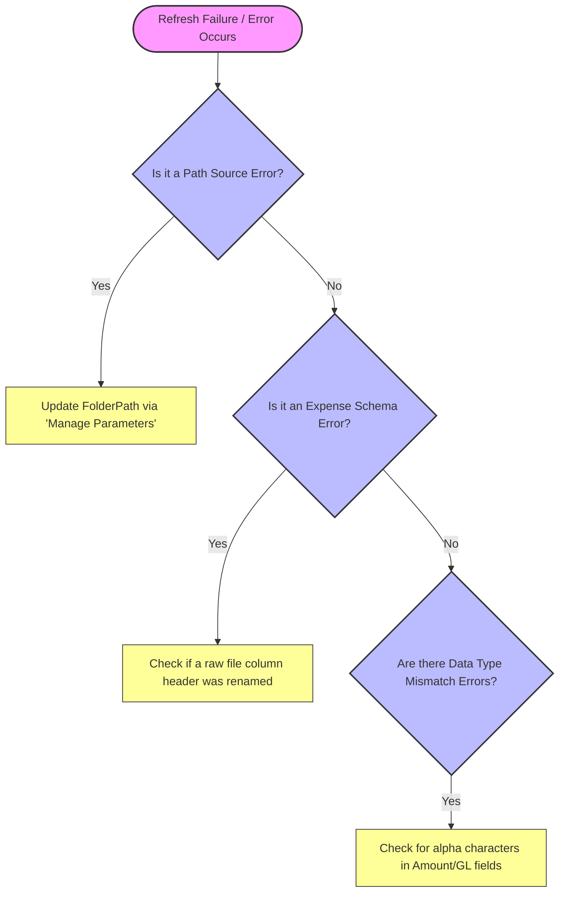

# 📄 Standard Operating Procedure (SOP)
**Process Name:** Automated SG&A (T&E Expense) Variance Reporting & Data Maintenance  
**Version:** 1.2  
**Effective Date:** July 11, 2026  
**Review Cycle:** Semi-Annual  
**Process Owner:** Lead FP&A Analyst / Data Architect  

---
## 1. Purpose & Scope
This Standard Operating Procedure (SOP) defines the mandatory steps for executing, maintaining, and scaling the automated Travel & Entertainment (T&E) financial variance reporting pipeline. 
This procedure covers the chronological data extraction from expense portals, structured directory placement, master data management within `Company Data.xlsx`, and the global parameter configuration required to refresh the unified analytics engine (`Variance Analysis.pbix`).

---
## 2. Roles & Responsibilities
*   **Accounting Clerks / Expense Admins:** Responsible for pulling raw banking/credit card transaction sheets and dropping them into the designated file system without altering data schemas.
*   **FP&A Analyst (Process Operator):** Responsible for executing data refreshes, performing month-end reconciliations against the General Ledger, and updating dimensional registries.
*   **FP&A Manager (Approver):** Responsible for verifying variance anomalies, approving dashboard rollouts to L1/L2 managers, and maintaining corporate budget targets.

---
## 3. Prerequisite Environment Configuration
Before executing a data refresh, ensure the workstation meets the following criteria:
1.  **Software:** Power BI Desktop (Latest Version) and Microsoft Excel installed.
2.  **File System Access:** Read/Write permissions granted to the cloned GitHub repository folder: `Financial-Reporting-Process-Transformation/`.

---
## 4. Step-by-Step Operational Workflow
### Step 4.1: Raw Transaction Ingestion
1.  Extract the weekly or monthly credit card actuals report from the ERP or banking platform.
2.  **Strict Rule:** Do not rename column headers, inject formulas, or delete empty rows in the raw export. The automated M-Code pipeline handles data cleaning natively.
3.  Save or move the file into the exact folder path matching the active financial year and reporting interval:
    *   **Weekly WIP Data:** `.../Variance Analysis/2026/Weekly/`
    *   **Closed Month Actuals:** `.../Variance Analysis/2026/Monthly/`
### Step 4.2: Maintaining Master Registries (`Company Data.xlsx`)
To ensure lookups do not fail when changes occur in corporate structures, update the central reference spreadsheet **prior** to refreshing the dashboard:
*   **New Hire / Termination:** Append new team members to the `Employee Data` sheet. If an employee departs, toggle their status flag to `Resigned`. *Do not delete historical rows, as this will break historical lookups.*
*   **New Cost Center / GL Account:** If the accounting team creates a new expense code, add it instantly to the `General Ledger` or `Department List` tab with its respective tier mappings.
### Step 4.3: Executing the Model Refresh & Global Portability Setup
1.  Open **`Variance Analysis.pbix`**.
2.  If the model was cloned to a new drive or machine, update the directory path to prevent a breakdown:
    *   On the **Home** tab ribbon, click the arrow beneath **Transform Data** $\rightarrow$ select **Edit Parameters**.
    *   In the **`FolderPath`** text box, paste your exact local directory path leading up to the `Variance Analysis` folder:
        *   *Example:* `C:\Users\YourName\Documents\GitHub\Financial-Reporting-Process-Transformation\Variance Analysis`
    *   Click **OK**.
3.  Click the main **Refresh** button on the Home tab ribbon.
4.  The pipeline will compile all files, execute database merges, and update the visuals within seconds.

---
## 5. Quality Control & Reconciliation Audits
To maintain strict Six Sigma quality control ($C_p \ge 1.33$), the process operator must execute a reconciliation audit at every month-end close:
1.  Navigate to the **Reconciliation Summary** matrix within the Power BI dashboard.
2.  Verify the calculated measure `[GL_Reconciliation_Gap]`. 
3.  **Acceptable Tolerance:** The value must equal exactly **`$0.00`**. 
4.  If a gap exists, cross-reference the `fact_CreditCardActuals` against the `dim_GeneralLedger` table to identify unmapped transaction codes or missing employee mappings.

---
## 6. Exception & Error Handling (Out-of-Control Action Plan)
When data anomalies or refresh blocks occur, consult the following standardized diagnostic matrix:

- **Path Exceptions (`DataSource.Error`):** Occurs if folders are renamed or local system drive mounts change. Fix by repeating **Step 4.3.2** via the Parameter Wizard.
- **Schema Exceptions (`Expression.Error - Column not found`):** Occurs if an upstream raw file export header was modified. Fix by navigating into the Power Query Advanced Editor and correcting the step schema mapping to match the new raw header.
- **Data Mismatches:** If text characters are discovered within the numeric `Amount spent` or `GL Numbers` columns, open the corresponding source spreadsheet, isolate the text anomalies, re-format the cell to numbers, save, and re-trigger the refresh.