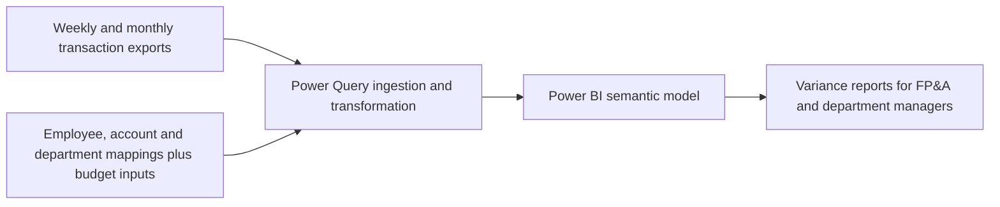

# Reporting Process Overview

This project standardizes weekly and monthly Selling, General and Administrative (SG&A) expense variance reporting, focused on Travel & Entertainment (T&E). The documented workflow uses Power Query to consolidate transaction files and reference datasets in the Power BI model, `Variance Analysis.pbix`.

**Confirmed production go-live:** July 1, 2026.  
**Documentation revision:** October 6, 2026.

## 1. Data Sources

The source documentation identifies six supporting input datasets, plus weekly and monthly credit-card transaction workbooks. Employee, account, department and P&L-group inputs provide reference mappings; budgets provide quantitative targets. These are datasets, rather than six independently verified enterprise systems.

| Input dataset     | Contents and purpose                                                                                                                                     |
| ----------------- | -------------------------------------------------------------------------------------------------------------------------------------------------------- |
| Employee master   | Employee IDs, organizational details and employment status.                                                                                              |
| Chart of accounts | GL account identifiers and titles, subcategories, US GAAP categories, and P&L / Balance Sheet grouping; classifications, rather than closed-GL balances. |
| Department master | Department codes, reporting directors, employee IDs and email details.                                                                                   |
| PNLgroups         | P&L group details, department codes and leaders. Preserve the source name.                                                                               |
| Monthly budget    | Monthly budget target input; verify period, department/account grain, currency and budget version.                                                       |
| Weekly budget     | Weekly budget target input; verify reporting calendar, grain and relationship to the monthly budget.                                                     |

The documented supporting workbook is `Company Data.xlsx`. Transaction actuals arrive in separate weekly and monthly workbooks. Budget inputs are described as fact tables in the conceptual model; verify their actual grain and relationships before comparing them with transaction-level actuals. This documentation revision does not inspect or change the PBIX file.

An independent closed-GL actuals export or control-total source is **required for the proposed GL reconciliation control**, but is not identified in the available inventory. Record its owner, period, currency, account scope and comparison method before describing GL reconciliation as implemented. A chart of accounts cannot supply those actual balances.

## 2. Folder Structure and Naming Conventions

The documented folder pattern is:

```text
Variance Analysis/
├── 2025/
│   ├── Monthly/
│   └── Weekly/
├── 2026/
│   ├── Monthly/
│   └── Weekly/
├── Company Data.xlsx
└── Variance Analysis.pbix
```

| Interval | Filename pattern | Example |
| --- | --- | --- |
| Monthly | `Credit_Cards_Data - NN Month.xlsx` | `Credit_Cards_Data - 01 January.xlsx` |
| Weekly | `Credit_Cards_Data - Week NN - Month.xlsx` | `Credit_Cards_Data - Week 14 - March.xlsx` |

Week numbering depends on the reporting calendar. A week crossing a month boundary may have separate month-labelled files, such as `Week 14 - March` and `Week 14 - April`. Do not assume that two files with the same week number are duplicates, or that a year contains exactly one file per week. Validate transaction identifiers and coverage before combining them.

The original inventory described 2025 files and a partial 2026 inventory through July. It is a historical example, not a verified current file count. New exports follow the applicable year and reporting-interval folders, subject to the approved naming and schema rules in [[SOP]].

## 3. Documented Data Flow

Power Query transforms the supporting datasets and weekly/monthly transaction workbooks for `Variance Analysis.pbix`. The documented model supports budget-versus-actual variance reporting for department managers and FP&A leadership; its queries, measures and relationships require direct verification.



At month-end, provisional weekly actuals and closed-month actuals may cover the same transactions. Accounting adjustments can supersede provisional amounts. Verify the actual model's month/week precedence and duplicate-handling rules before releasing reports; appending overlapping inputs alone is not sufficient evidence of accurate totals.

Document the reporting calendar, budget version, comparison grain and expense-variance sign convention. Weekly and monthly budgets must not be added together for the same scope unless an explicit approved calculation requires it. Retaining an employee key preserves identity mapping; the policy for transaction-date versus current department/hierarchy reporting remains unverified.

## 4. Operating and Measurement Boundaries

Automated consolidation and model refresh support the reporting workflow. Operators still extract and file exports, maintain master data, reconcile totals and initiate Desktop refreshes. Email distribution is outside the charter scope; scheduled refresh and automated alerts require separate deployment evidence.

Use three separate measurements: elapsed reporting lead time, analyst labor-hours, and model-refresh duration. The reported legacy 48-hour weekly and 36-hour monthly timings have an unverified measurement basis and must not be directly compared with refresh minutes as a demonstrated reduction.

For operating steps and controls, use [[SOP]]. For project scope, use [[Project Charter]]. For conflicting workbook dates and provisional source summaries, use [[Evidence Reconciliation|Evidence Reconciliation]].
